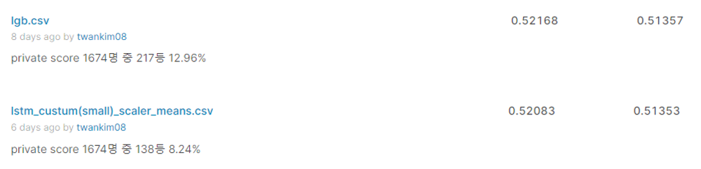
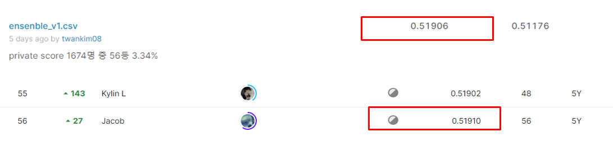

# Favorita Grocery Sales Forecasting

# 결과
---
### 요약정보
<ul>
    <li>도전기관:시큐레이어</li>
    <li>도전자:김택완</li>
    <li>최종스코어:0.51906</li>
    <li>제출일자:2022-07-26</li>
    <li>총 참여 팀 수:1674</li>
    <li>순위 및 비율:56(3.34%)</li>
</ul>

# 결과화면
---

# 사용한 방법 & 알고리즘
---
<ul>
    <li>파생변수 생성</li>
    <li>LightGBM model 사용</li>
    <li>LSTM model 사용</li>
    <li>최종 모델 LightGBM</li>
</ul>

# 코드
---
[소스 코드](Favorita_lgbm.ipynb)

# 참고자료
