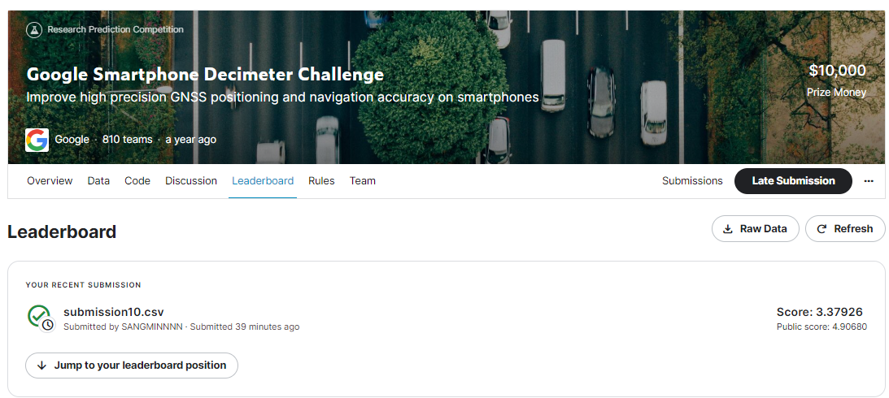
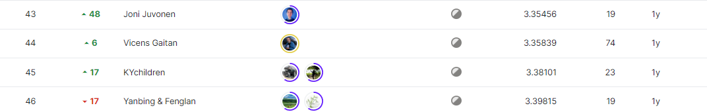
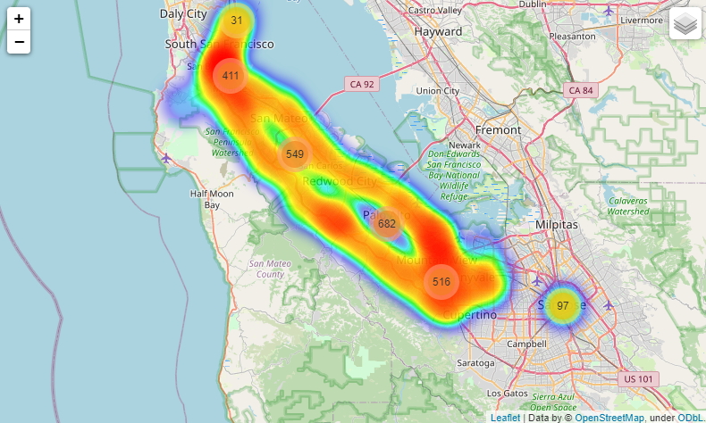

# google-smartphone-decimeter-challenge
---
# 결과
---
### 요약 정보
* 도전기관 : 시큐레이어
* 도전자 : 이상민
* 최종 스코어 : 3.37926
* 제출 일자 : 2022-12-05
* 총 참여 팀수 : 811
* 순위 및 비율 : 45 (5%)

# 결과 화면
---

# 사용한 방법 & 알고리즘
---
### 문제
* 스마트폰의 GNSS(Global Navigation Satellite System) 위치추정정확도 향상

  ##### - 데이터
  * 시간(timestamp)에 상응하는 
    * 위치데이터(위경도 등)와
    * GNSS를 통해 수집한 다양한 센서데이터(GNSS상태, ACCEL, Gyro, Magnetometer, device orientation)가 존재
  * 

### 해결방법
* 데이터
  * 데이터 위치분류 카테고리를 위해 샘플값 정수인코딩
* 모델링
  * KNN모델 사용
    * 데이터의 위치를 세가지 카테고리내 인덱싱값으로 분류; 시내/나무/고속도로 + {idx}
  * 분류된 인덱싱 값에 대해서 위경도기반 거리계산(haversine)을 통해 가장 부드러운경로가 되는 값을 도출
    * train 데이터를 통해 위경도기반 거리계산시 사용되는 상수 parameter의 최적값을 도출

# 코드
---
[`./decimeter.ipynb`](./decimeter.ipynb)

# 참고자료
---
data categories(3):  https://www.kaggle.com/c/google-smartphone-decimeter-challenge/discussion/245160