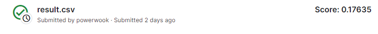
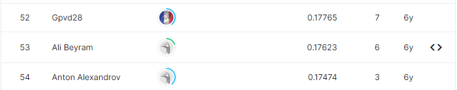

# integer-sequence-learning

## 결과

### 요약정보

- 도전기관 : 시큐레이어
- 도전자 : 김현욱
- 최종스코어 : 0.176
- 제출일자 : 2022-11-29
- 총 참여 팀 수 : 284
- 순위 및 비율 : 53(18.66%)

### 결과화면

## 문제 설명, 해결 방법

### 목표
정수 시퀀스의 다음 숫자 예측

### 문제 해결 방법 
선형 모델 사용
## 코드
[code](./integer.ipynb)

## 참고 자료