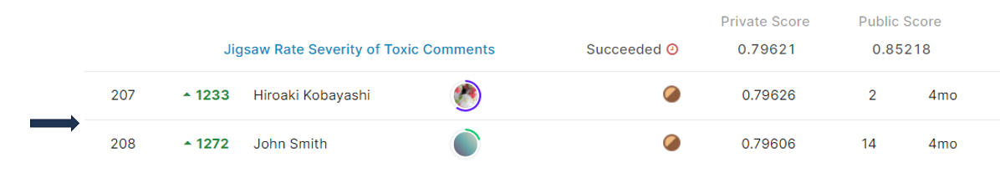

# jigsaw-toxic-severity-rating
## 결과 요약
도전기관 : 시큐레이어    
도전자 : 엄현빈     
최종스코어 : 0.79621     
제출일자 : 2022-04-25      
총 참여 팀 수 : 2301      
순위 및 비율 : 208(9.03%)      

## 결과 화면

## 문제 설명, 해결 방법
### 목표
텍스트의 상대적 유해도 예측(유해도 순위 판별)

### 문제 해결 방법
1. 여러 데이터 set 이용하여 결과 산출(대회에서 Train Dataset 제공하지 않음)
2. Jigsaw Dataset의 유해도 산출 -> 항목별 수치 값을 더한 뒤, 최대값으로 나누어 산출. 이 때, severe_toxic은 가중치 2배 적용
3. Ruddit Dataset의 유해도 산출 -> offensiveness_score에 min-max scaling을 통해 0~1 사이로 범위 조정
4. Ridge, RoBERTa 모델 ensemble -> 최종 score 산출

## 코드
[jigsaw-toxic-severity-rating](https://github.com/Umhyunbin/AutoAPE-challenge3/blob/901e88652995473c4968cb26b832cb556e6ed1c6/kaggle/jigsaw-toxic-severity-rating/jigsaw-toxic-severity-rating.ipynb)

