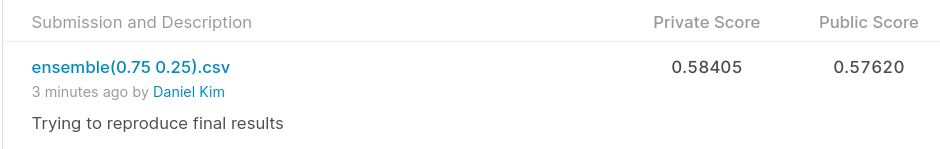

# KDD Cup 2014 - Predicting Excitement at DonorsChoose.org
## 결과
### 요약정보
- 도전기관: 한양대학교
- 도전자: 김진훈
- 최종스코어: 0.58405
- 제출일자: 2022-05-13
- 총 참여 팀수: 472
- 순위 및 비울: 34.3%
### 결과화면

## 사용한 방법 & 알고리즘
- Model 1
  - Preprocessing: used only categorical values and one hot encoding
  - Models: ensemble of LogisticRegression and LGBMClassifier
- Model2
  - Preprocessing: TFIDFVectorizer for the essays written by the professors 
  - Models: ensemble of LogisticRegression and LGBMClassifier
## 코드
[`./kdd-cup-2014-predicting-excitement-at-donors-choose.ipynb`](./kdd-cup-2014-predicting-excitement-at-donors-choose.ipynb)
## 참고 자료
- Model 1: https://www.kaggle.com/competitions/kdd-cup-2014-predicting-excitement-at-donors-choose/discussion/9347
- Model 2: https://www.kaggle.com/competitions/kdd-cup-2014-predicting-excitement-at-donors-choose/discussion/8228
