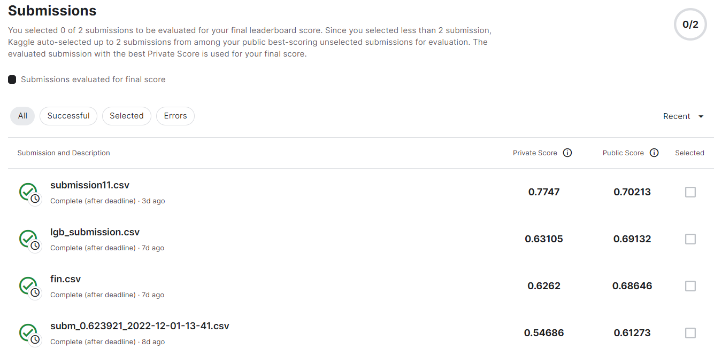
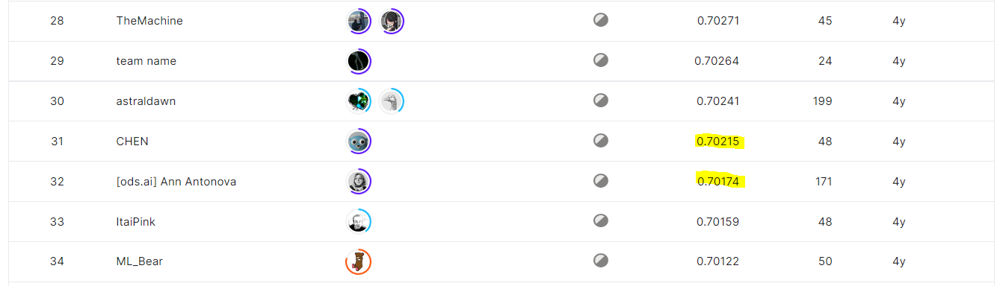

# Microsoft Malware Prediction
## 결과
### 요약정보
- 도전기관: 시큐레이어
- 도전자: 문일주
- 최종스코어: 0.702
- 제출일자: 2022-12-06
- 총 참여 팀수: 2410
- 순위 및 비율: 32(7.53%)
### 결과화면

## 사용한 방법 & 알고리즘
 - LightGBM 모델 
## 코드
[code](./microsoft-malware-prediction.ipynb)

## 참고 자료
- https://www.kaggle.com/datasets/cdeotte/malware-timestamps-2
- https://www.kaggle.com/datasets/cdeotte/malware-timestamps
