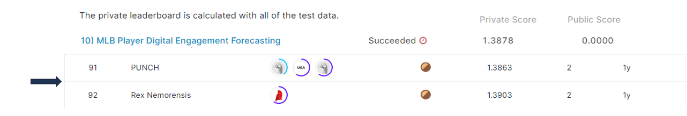

# mlb-player-digital-engagement-forecasting

## 결과 요약
도전기관 : 시큐레이어    
도전자 : 엄현빈     
최종스코어 : 1.3878     
제출일자 : 2022-06-09      
총 참여 팀 수 : 852      
순위 및 비율 : 92(10.79%)      

## 결과 화면

## 문제 설명, 해결 방법
### 목표
팬의 MLB 선수 디지털 컨텐츠 참여 방식 예측

### 문제 해결 방법
1. Nested JSON Fields(train set의 feature) -> Dataframe으로 변환한 뒤, 기존 train set과 merge
2. 기존 target 값들이 feature로 유의할 것이라고 판단 -> target1 ~ target4의 mean, median, std, min, max를 feature로 추가
3. Lightgbm docs -> hyperparamater tuning 참고하여 Overfitting, Accuracy 관점에서 tuning 진행    
[Lightgbm_hyperparameter_tuning](https://lightgbm.readthedocs.io/en/latest/Parameters-Tuning.html)
4. Lightgbm 모델 사용

## 코드
[mlb-player-digital-engagement-forecasting](https://github.com/Umhyunbin/AutoAPE-challenge3/blob/818a76c7c756cb7ae29a5bcd8f0e91a549e0dcbc/kaggle/mlb-player-digital-engagement-forecasting/mlb-player-digital-engagement-forecasting.ipynb)
