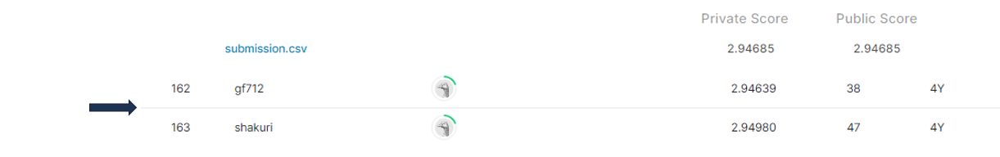

# new-york-city-taxi-fare-prediction

## 결과 요약
도전기관 : 시큐레이어    
도전자 : 엄현빈     
최종스코어 : 2.94685     
제출일자 : 2022-06-27      
총 참여 팀 수 : 1483      
순위 및 비율 : 163(10.99%)      

## 결과 화면

## 문제 설명, 해결 방법
### 목표
출발 위경도, 도착 위경도가 주어졌을 때 뉴욕 택시 요금 예측

### 문제 해결 방법
1. 2000만개의 train data slicing(행의 시간이 random하고, 9914개의 적은 test set)
2. 도메인 기반 데이터 전처리(NYC Taxi 기본요금 : 2.5\$, 최대 정원 6명)
3. 구면좌표계 상에서 위경도를 이용해 출발지~도착지 거리를 구하는 'haversine formula' 이용
4. Xgboost, Lightgbm 사용. 성적에서는 xgboost가 더 좋았지만, 학습 시간은 lightgbm이 더 빨랐음

## 코드
[new-york-city-taxi-fare-prediction](https://github.com/Umhyunbin/AutoAPE-challenge3/blob/060b80dc126cbd7ba84afba961c8be8ab5b2f6c5/kaggle/new-york-city-taxi-fare-prediction/new-york-city-taxi-fare-prediction.ipynb)
