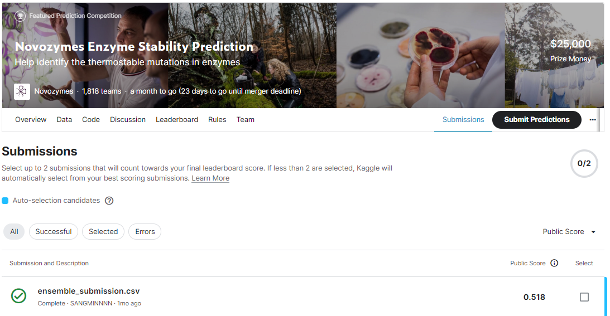
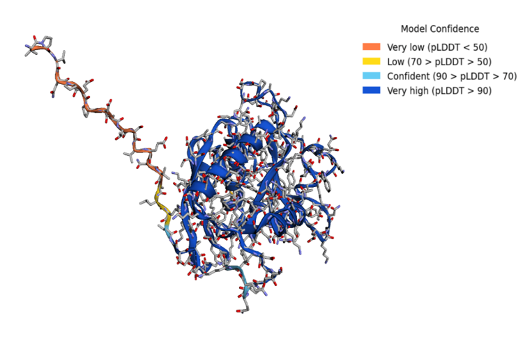

# novozymes-enzyme-stability-prediction
---
# 결과
---
### 요약 정보
* 도전기관 : 시큐레이어
* 도전자 : 이상민
* 최종 스코어 : 0.518
* 제출 일자 : 2022-10-24
* 총 참여 팀수 : 1673
* 순위 및 비율 : 487 (29%)

# 결과 화면
---

# 사용한 방법 & 알고리즘
---
### 문제
* 특정 용해 온도 환경에서 효소변이체의 열안정성 예측

  ##### - Data
  * train data는 31390개의 단백질서열과 이에 대응하는 산(pH), 온도(tm), 데이터소스(data_source)가 존재
  * test data는 train data와 같은 형식으로 2413개의 데이터 존재
  * (Feature Extraction 을 통한 단백질서열 3차원 도식화)
  * 

### 해결방법
* Feature
  * 생명공학에서 사용되는 도구를 통해 효소변이체의 열안정성 판단에 사용되는 피처 추출
    * 단백질서열의 고유 WILDTYPE / Mutation / dG, 적정 pH / Tm 테이블
    * PDB 단백질 정보 파일
    * 아미노산 정규표
    * WILD-TYPE <-> MUTATION 치환행렬 (deMaSK, Blosum)
    * SOTA 단백질 변압기 임베딩
  * PCA를 통한 피처 차원 축소
* Modeling
  * XGBoost 사용

# 코드
---
[`./nobozymes.ipynb`](./nobozymes.ipynb)

# 참고자료
---
* WILDTYPE: https://github.com/deepmind/alphafold/blob/main/afdb/README.md
* PDB: https://files.rcsb.org
* Properties of Aminoacids: https://www.kaggle.com/datasets/alejopaullier/aminoacids-physical-and-chemical-properties
* deMaSK: https://demask.princeton.edu/about/
* SOTA: https://github.com/facebookresearch/esm
