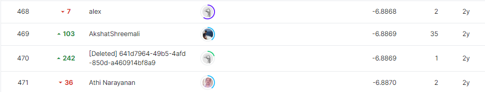
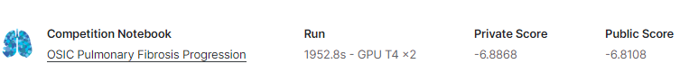
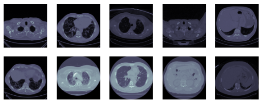

# osic-pulmonary-fibrosis-progression
---
# 결과
---
### 요약 정보
* 도전기관 : 시큐레이어
* 도전자 : 이상민
* 최종 스코어 : -6.8868
* 제출 일자 : 2022-11-11
* 총 참여 팀수 : 2097
* 순위 및 비율 : 469 (22%)

# 결과 화면
---

# 사용한 방법 & 알고리즘
---
### 문제
* 환자의 폐 CT스캔과 메타데이터를 이용한 환자의 폐 기능 저하 정도 예측문제

  ##### - 데이터
  * train data는 1547명의 환자에 대한 CT스캔파일과 이에 대응하는 7열의 메타데이터 존재
  * test data는 train data와 같은 형식으로 5명의 환자데이터 존재
  * 

### 해결방법
* 데이터
  * GaussianNoise 를 고려한 데이터 모델링
* 모델링. 앙상블
  * model1: EfficientNet 사용 (b0~b7 성능검증결과 b5를 사용)
    * GlobalAveragePooling2D 를 통한 EfficientNet 의 차원축소
    * Dropout 을 사용하여 과적합 방지
  * model2: deep learning model 사용
    * ReLU 활성화함수 사용
    * K-fold 교차검증을 통한 최적의 모델 도출
  * 앙상블: weight를 적용한 합으로 폐 기능 저하 정도 산출  

# 코드
---
[`./pulmonary.ipynb`](./pulmonary.ipynb)

# 참고자료
---
* OSIC Model Weights: https://www.kaggle.com/datasets/khoongweihao/osic-model-weights
* kerasapplications: https://www.kaggle.com/datasets/vgarshin/kerasapplications
* efficientnet: https://www.kaggle.com/datasets/vgarshin/efficientnet
