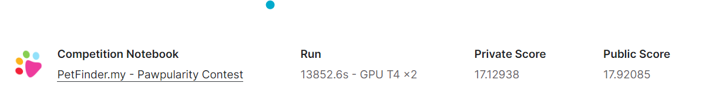
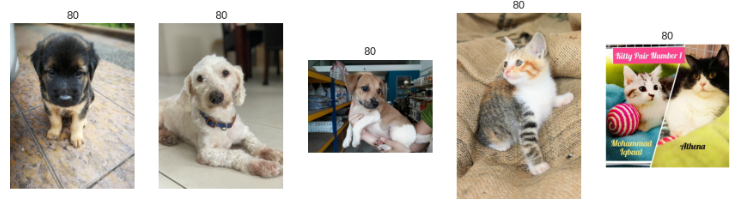

# petfinder-pawpularity-score
---
# 결과
---
### 요약 정보
* 도전기관 : 시큐레이어
* 도전자 : 이상민
* 최종 스코어 : 17.12938
* 제출 일자 : 2022-11-21
* 총 참여 팀수 : 3489
* 순위 및 비율 : 683 (19%)

# 결과 화면
---

# 사용한 방법 & 알고리즘
---
### 문제
* 애완동물의 사진과 메타데이터를 이용한 귀여움의 정도(pawpularity) 측정문제

  ##### - 데이터
  * train data는 9912장의 이미지파일과 이에 대응하는 12열의 메타데이터 존재
  * test data는 train data와 같은 형식으로 8개의 데이터 존재
    

### 해결방법
* 데이터
  * RMSE를 기반으로 K-fold 교차검증방식을 통해 최적의 BIN 추출
  * 색상(hue), 채도(saturation), 명도(brightness) 조정을 통한 Data Augmentation
* 모델링
  * 이진분류 손실함수 BCEWithLogitsLoss 사용 
  * swin-transformer model (swin_large_patch4_window7_224) 사용

# 코드
---
[`./petfinder.ipynb`](./petfinder.ipynb)

# 참고자료
---
* Swin-Transformer git: https://github.com/microsoft/Swin-Transformer
* Swin-Transformer library: https://www.kaggle.com/datasets/tanlikesmath/swin-transformer
* timm library: https://www.kaggle.com/datasets/kozodoi/timm-pytorch-image-models