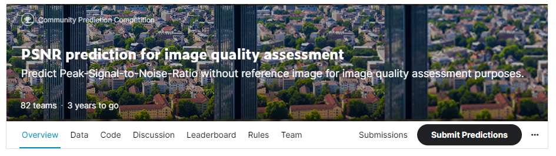

# PSNR prediction for image quality assessment

## 결과

### 요약정보

- 도전기관 : 한양대학교
- 도전자 : 김병현
- 최종스코어 : 0.70073
- 제출일자 : 2022-08-31
- 총 참여 팀 수 : 82
- 순위 및 비율 : 6(7.31%)

### 결과화면

## 사용한 방법 & 알고리즘

Ensemble + SVD(Singular Value Decomposition)

## 코드
[`./pre_processing.py`](./pre_processing.py)
[`./run.py`](./run.py)

## 참고 자료

