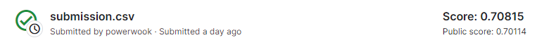
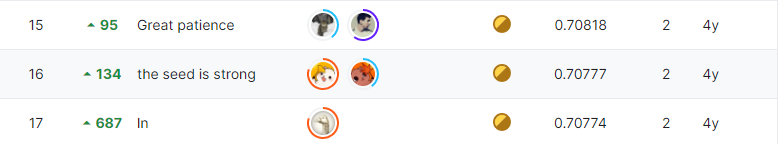

# quora-insincere-questions-classification

## 결과

### 요약정보

- 도전기관 : 시큐레이어
- 도전자 : 김현욱
- 최종스코어 : 0.708
- 제출일자 : 2022-11-30
- 총 참여 팀 수 : 4037
- 순위 및 비율 : 16(0.39%)

### 결과화면

## 문제 설명, 해결 방법

### 목표
웹사이트 플랫폼의 성실하지 않은 질문 분류

### 문제 해결 방법 
데이터세트와 함께 제공된 임베딩 활용

Attention 메커니즘 활용

## 코드
[code](./quora.ipynb)

## 참고 자료

