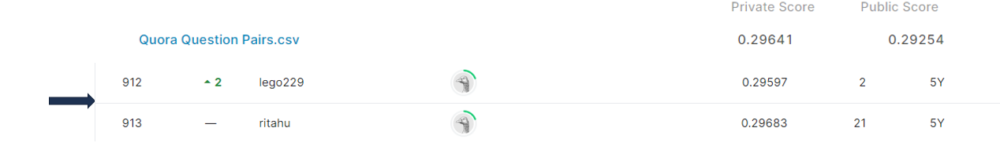

# quora-question-pairs

## 결과 요약
도전기관 : 시큐레이어    
도전자 : 엄현빈     
최종스코어 : 0.29641     
제출일자 : 2022-05-03      
총 참여 팀 수 : 3295      
순위 및 비율 : 913(27.7%)      

## 결과 화면

## 문제 설명, 해결 방법
### 목표
2개의 question이 유사한 의미를 가지는지 예측 

### 문제 해결 방법
1. 접어(clitic)처리, 축약 숫자 처리 등 데이터 전처리 진행
2. 두 문장의 유사도 측정 -> Bert Tokenizer format(\[CLS\] question1 \[SEP\] question2 \[SEP\]\[PAD\]...\[PAD\])에 맞게 두 문장 삽입
3. Perplexity를 기준으로 모델 훈련 중 매개변수, 현재 perplexity 값 저장
4. BERT 모델 사용

## 코드
[quora-question-pairs](https://github.com/Umhyunbin/AutoAPE-challenge3/blob/d4e89897ce09e6c14dbe1c7886ec7a0b2a694c2c/kaggle/quora-question-pairs/quora-question-pairs.ipynb)
