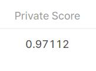

# ranzcr-clip-catheter-line-classification

## 결과

### 요약정보

- 도전기관 : 한양대학교
- 도전자 : 장이완
- 최종스코어 : 0.97112
- 제출일자 : 2022-08-16
- 총 참여 팀 수 : 1547
- 순위 및 비율 : 122(7.9%)

### 결과화면

## 사용한 방법 & 알고리즘

흉부 엑스레이에서 카테터와 선의 존재와 위치를 감지
40,000개의 이미지에서 모델을 훈련하고 테스트하여 잘못 배치된 튜브를 분류

### DATA

train.csv - 이미지 ID, 바이너리 레이블 및 환자 ID를 포함
train - 훈련 이미지
테스트 - 테스트 이미지

### Model
 seResNet152d
 ResNet200d

## 코드
[./ranzcr-clip.ipynb](./ranzcr-clip.ipynb)

## 참고 자료

