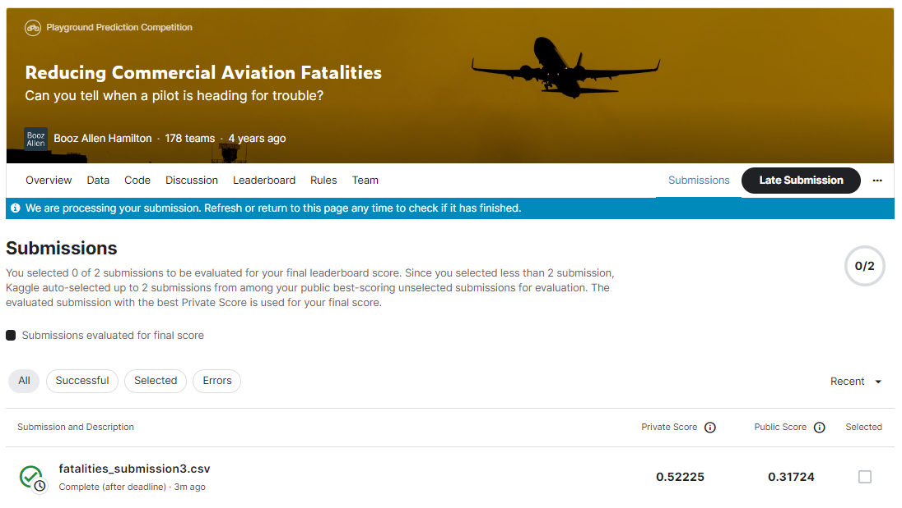
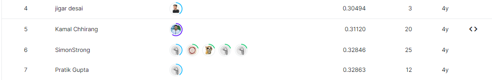

# reducing-commercial-aviation-fatalities
---
# 결과
---
### 요약 정보
* 도전기관 : 시큐레이어
* 도전자 : 이상민
* 최종 스코어 : -0.31724
* 제출 일자 : 2022-11-02
* 총 참여 팀수 : 179
* 순위 및 비율 : 6 (3%)

# 결과 화면
---

# 사용한 방법 & 알고리즘
---
### 문제
* 파일럿의 생리학적 데이터를 통한 인지상태 분류

  ##### - 데이터
  * 파일럿 인덱싱 데이터 5개와 생리학적데이터 23개, 이에 대응하는 파일럿의 상태(y) 1개로 구성
  * train 데이터 총 4,867,421 / test 데이터 총 17,965,143

### 해결방법
* 데이터
  * 메모리 최적화. 데이터손실이 없으면서 동시에 모든 데이터를 포괄할 수 있는 데이터타입으로 typecasting
* 모델링. 앙상블
  * Light GBM 사용
    * 최적의 모델을 산출하기 위해 총 2000회의 boost-round 를 수행. 
    * 최근 200 boost-round동안 갱신되지 않은 가장 좋은 값 산출시 boost-round 종료

# 코드
---
[`./fatalities.ipynb`](./fatalities.ipynb)

# 참고자료
---
