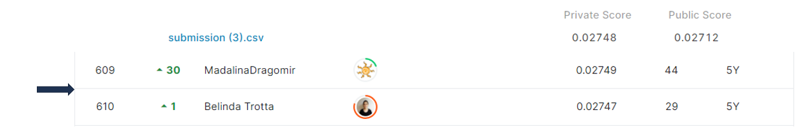

# santander-product-recommendation

## 결과 요약
도전기관 : 시큐레이어    
도전자 : 엄현빈     
최종스코어 : 0.02748     
제출일자 : 2022-03-12      
총 참여 팀 수 : 1779      
순위 및 비율 : 610(34.28%)      

## 결과 화면

## 문제 설명, 해결 방법
### 목표
고객 과거 이력, 유사한 고객군들의 데이터를 기반으로 고객의 신규 구매 상품 예측

### 문제 해결 방법
1. 데이터에 맞는 다양한 전처리 진행 (ex: 지역별 가구 총 수입 격차 확인 -> '가구 총 수입 결측값'을 '지역별 소득 중앙값'으로 대체)
2. 고객의 과거 상품 보유 내역이 신규 구매에 영향을 끼친다고 판단 -> 과거 상품 보유 내역을 독립 변수에 추가
3. 특정 시점에서 고객의 '상품 보유 여부'가 아닌, '신규 구매 여부'에 관심 -> (관측 시점 보유) & (1달 전 미보유)인 경우를 1, 나머지 경우를 0으로 종속 변수 설정
4. Xgboost 모델 사용

## 코드

