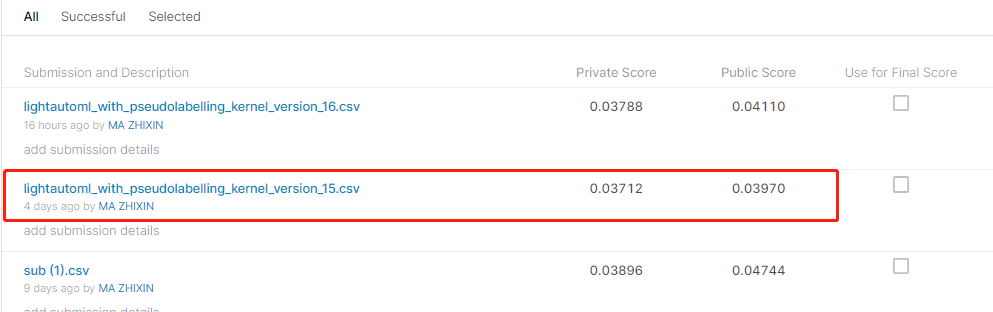
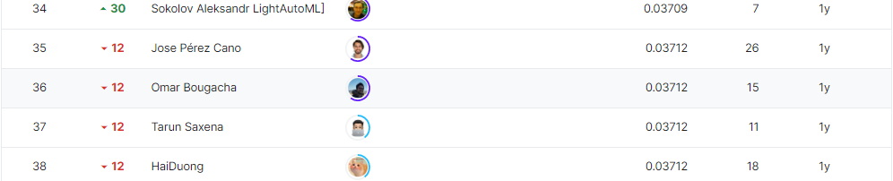

# Tabular Playground Series - Jul 2021

## 결과

### 요약정보

- 도전기관 : 한양대학교
- 도전자 : 마지흔
- 최종스코어 : 0.03712
- 제출일자 : 2022-08-31
- 총 참여 팀 수 : 1293
- 순위 및 비율 : 35(2.71%)

### 결과화면

## 사용한 방법 & 알고리즘

lightautoml 라이브러리를 사용합니다

## 코드

[`./tabular.ipynb`](./tabular.ipynb)

## 참고 자료

