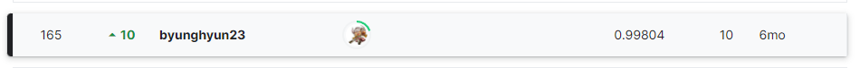

# Tabular Playground Series - May 2022

## 결과

### 요약정보

- 도전기관 : 한양대학교
- 도전자 : 김병현
- 최종스코어 : 0.99804
- 제출일자 : 2022-05-31
- 총 참여 팀 수 : 1151
- 순위 및 비율 : 165(14.33%)

### 결과화면

## 사용한 방법 & 알고리즘

1D CNN + LSTM

## 코드

[`./run.py`](./run.py)

## 참고 자료

