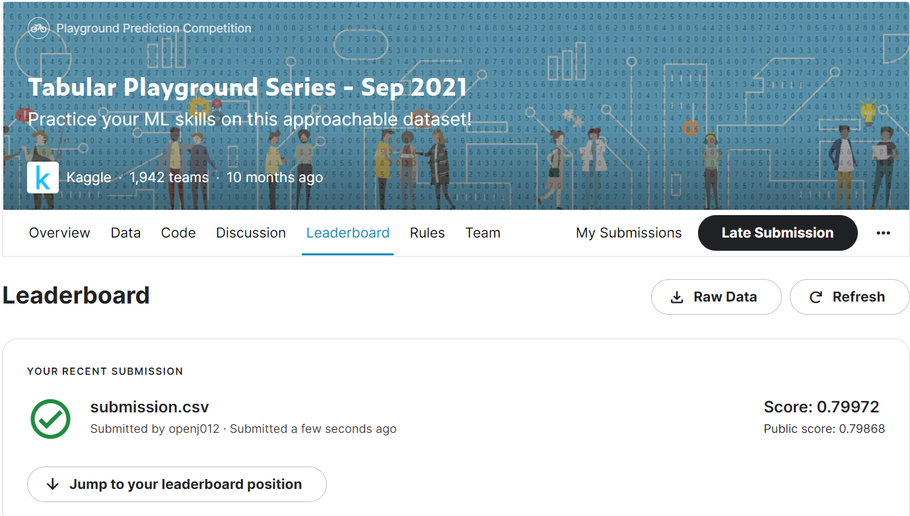
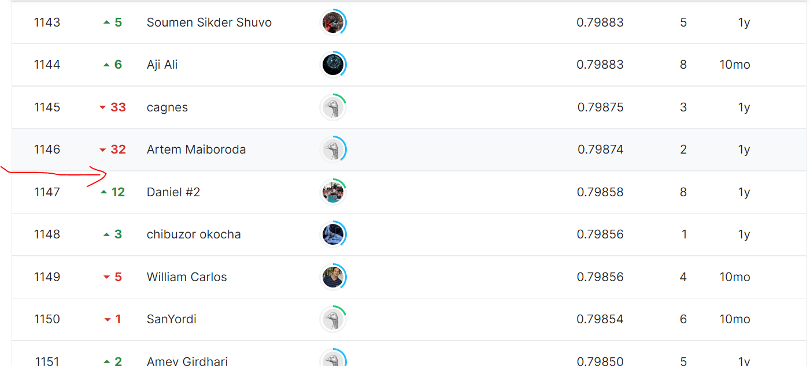

### 요약정보 
- 도전기관 : 한양대 
- 도전자 : 김현주 
- 최종스코어 :  0.799720
- 제출일자 : 2022-08-10
- 총 참여 팀수 : 1942
- 순위 및 비율 : 1147(59%)

### 결과화면 
 
 

### 사용한 방법 & 알고리즘 
binary clssification target 
- Feature 의 종류 
  120 columns/numerical and nomial columns 
- XGBClassifier 사용하여 모델링함 
- Baysian optimization 을 이용하여 parameter tuning 함 
