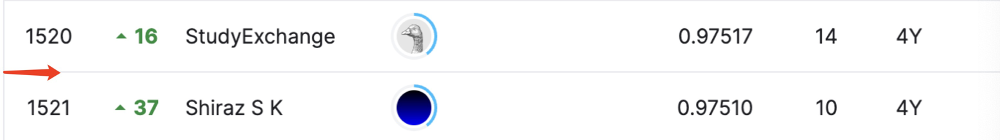

# TalkingData AdTracking Fraud Detection Challenge

## 결과

### 요약정보

- 도전기관 : 한양대학교
- 도전자 : 강경문
- 최종스코어 : 0.97515
- 제출일자 : 2022-06-20
- 총 참여 팀 수 : 3943
- 순위 및 비율 : 1521(38.5%)

### 결과화면

## 사용한 방법 & 알고리즘
데이터 양에 비해 feature이 너무 적어므로 Feature Generation을 하였습니다.
총 25가지 feature을 가지고 모델을 훈련 시켰습니다.

XGBoost와LightGBM 모델을 사용하였는데 결과로는 LightGBM모델이 효과가 더 좋았습니다.

## 코드

[`./TalkingData.ipynb`](./TalkingData.ipynb)

## 참고 자료

