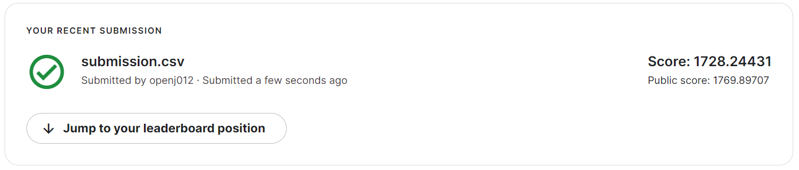

### 요약정보 
- 도전기관 : 한양대 
- 도전자 : 김현주 
- 최종스코어 :  1769.89707
- 제출일자 : 2022-08-07
- 총 참여 팀수 : 829
- 순위 및 비율 : 8(0.9%)

### 결과화면 
 
 

### 사용한 방법 & 알고리즘 
- XGBoost 알고리즘을 사용하여 모델링함 
- hyper parameter 튜닝을 통한 성능향상