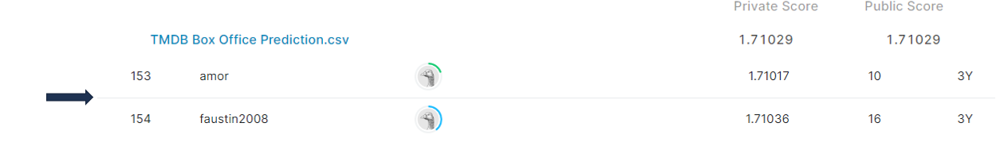

# tmdb-box-office-prediction

## 결과 요약
도전기관 : 시큐레이어    
도전자 : 엄현빈     
최종스코어 : 1.71029     
제출일자 : 2022-05-19      
총 참여 팀 수 : 1395      
순위 및 비율 : 154(11.03%)      

## 결과 화면

## 문제 설명, 해결 방법
### 목표
영화 흥행에 따른 수익 예측

### 문제 해결 방법
1. 이름이 같은 영화(원작 영화 리메이크 / 다른 영화) -> 모두 다른 영화로 처리
2. JSON 형식의 column -> 내용을 추출하여 column으로 활용
3. 외부 데이터 추가 가능 -> feature 추가(평점, 평점 인원 수 등) / row 추가
4. Xgboost, Lightgbm, Catboost Ensemble 진행 -> 최종적으로 Lightgbm + Catboost 사용  

## 코드
[tmdb-box-office-prediction](https://github.com/Umhyunbin/AutoAPE-challenge3/blob/4e25c9ae18442844d4e87a7dea64b349cff35166/kaggle/tmdb-box-office-prediction/tmdb-box-office-prediction.ipynb)
