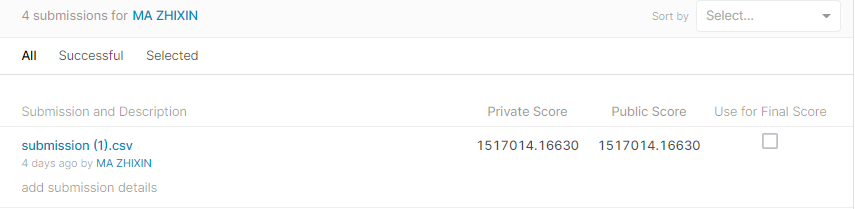
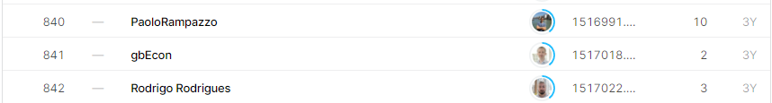

# Traveling Santa 2018 - Prime Paths

## 결과

### 요약정보

- 도전기관 : 한양대학교
- 도전자 : 마지흔
- 최종스코어 : 1517014.16630
- 제출일자 : 2022-01-24
- 총 참여 팀 수 : 1867
- 순위 및 비율 : 841(45.05%)

### 결과화면

## 사용한 방법 & 알고리즘

TSP 문제입니다. concorde 라이브러리의 TSPsolver함수를 사용합니다

## 코드

[`./santa.ipynb`](./santa.ipynb)

## 참고 자료

