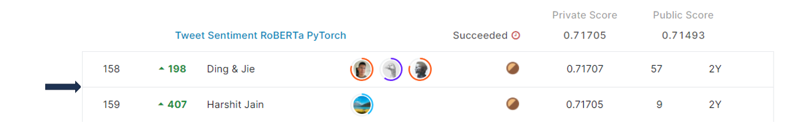

# tweet-sentiment-extraction

## 결과 요약
도전기관 : 시큐레이어    
도전자 : 엄현빈     
최종스코어 : 0.71705    
제출일자 : 2022-03-22      
총 참여 팀 수 : 2225      
순위 및 비율 : 159(7.14%)      

## 결과 화면

## 문제 설명, 해결 방법
### 목표
문장의 감정을 잘 나타내는 구문 추출

### 문제 해결 방법
1. 결측값 처리 -> 텍스트가 없는 경우 감정을 판단할 문구가 없어 중립으로 처리한다고 판단 -> 결측값을 삭제하지 않음
2. text마다 RoBERTa 모델의 format(%3Cs%3E A %3C%2Fs%3E%3C%2Fs%3E B %3C%2Fs%3E)을 맞추기 위해 처리
3. 긍정, 부정 / 중립 label이 다른 양상을 보임 -> StratifiedKfold로 교차검증 진행
4. RoBERTa 모델 사용. 정답 구문의 start, end index / 예측한 start, end index의 Jaccard Score를 산출

## 코드
[tweet-sentiment-extraction]()

