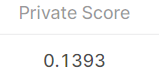

# Google Brain - Ventilator Pressure Prediction

## 결과

### 요약정보

- 도전기관 : 한양대학교
- 도전자 : 장이완
- 최종스코어 :0.1393
- 제출일자 : 2022-05-27
- 총 참여 팀 수 : 2605
- 순위 및 비율 : 755(28.98%)

### 결과화면

## 사용한 방법 & 알고리즘

현재 가장 높은 점수를 받은 공공 노트의 동일한 입력을 사용하여 중위수를 계산하므로, weight도 필요하지 않습니다.

## 코드

[`./new-ensemble-of-public-notebooks.ipynb`](./new-ensemble-of-public-notebooks.ipynb)

## 참고 자료

