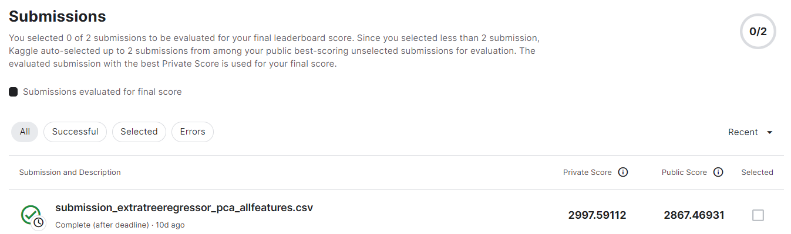
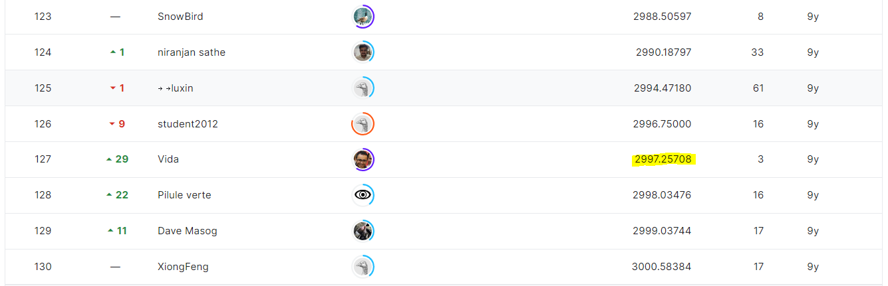

# walmart-recruiting-store-sales-forecasting

## 결과

### 요약정보

- 도전기관 : 시큐레이어
- 도전자 : 문일주 
- 최종스코어 : 2682.53159
- 제출일자 : 2022-12-01
- 총 참여 팀 수 : 688
- 순위 및 비율 : 25 (3.63%)

### 결과화면

사용한 방법 & 알고리즘
- ExtraTreesRegressor, RandomForestRegressor 모델 앙상블

## 코드
[code](./walmart-recruiting-store-sales-forecasting.ipynb)

