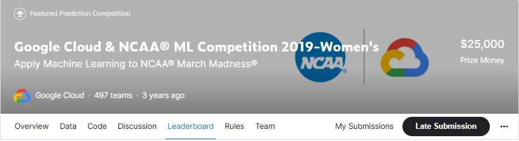
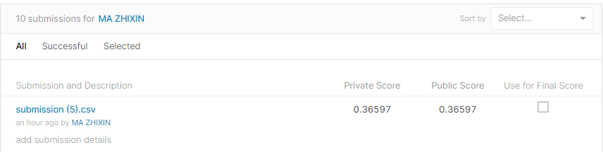
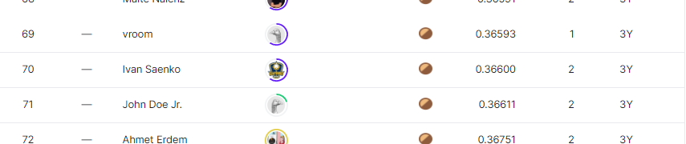

# Google Cloud & NCAA® ML Competition 2019-Women's

## 결과

### 요약정보

- 도전기관 : 한양대학교
- 도전자 : 마지흔
- 최종스코어 : 0.36597
- 제출일자 : 2022-03-14
- 총 참여 팀 수 : 497
- 순위 및 비율 : 70(14.08%)

### 결과화면

## 사용한 방법 & 알고리즘

XGBoost

## 코드

[`./women.ipynb`](./women.ipynb)

## 참고 자료

